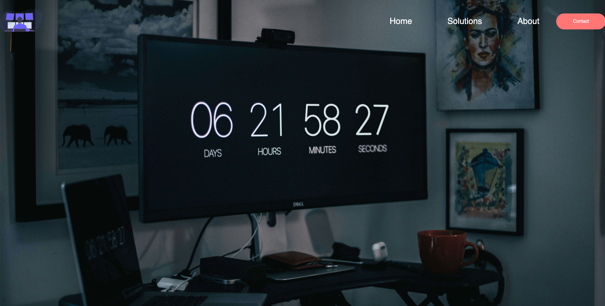

# Project Title

Well I learnt flexbox and wanted to see how I can manage a basic navbar with flexbox without using bootstrap, hacks or floats
## Getting Started

Create a header tag with an image, 1-3 nav items , and a single button.
Make the header a flex-header and move the navbar items accordingly. 
Last but not least, style the damn thing! Make your basic page look nice.
Have a nice day ! 

### Prerequisites

Get a basic handle on html/css before looking at the basic code
